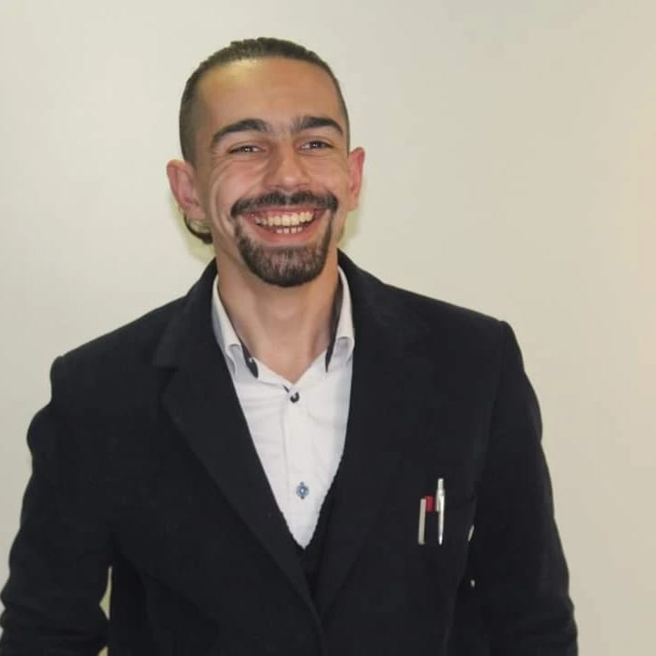

# As nossas vozes

## Celso Monteiro

Celso Monteiro, 21 anos, solteiro, licenciado em História, aluno de Mestrado em Administração Público-Privada. Ligado ao associativismo jovem durante 8 anos, coordenador do pelouro da Juventude em duas associações nacionais ( AMIP, MCD). Recente membro da IL, sempre resistente a atividade partidária, mas convencido pela forma diferenciada como o partido se apresenta a sociedade e graças às soluções que apresenta decidi entrar para mudar o país e a minha amada cidade. Coimbra precisa de mudança e os conimbricenses precisam de uma Nova Coimbra Liberal !

-------------------------

## José Lopes

José Lopes, 19 anos, nascido e criado em Coimbra. Estuda História, na Faculdade de Letras da Universidade de Coimbra, estando no segundo ano de licenciatura. Reparte o seu tempo entre estudo universitário, associativismo académico e participação político-partidária. Membro da IL desde 2022 - e simpatizante desde 2020 - procura defender pela sociedade portuguesa os valores da democracia liberal, economia de mercado e liberdades cívicas, além da implementação do Liberalismo na política local, especialmente em Coimbra.

